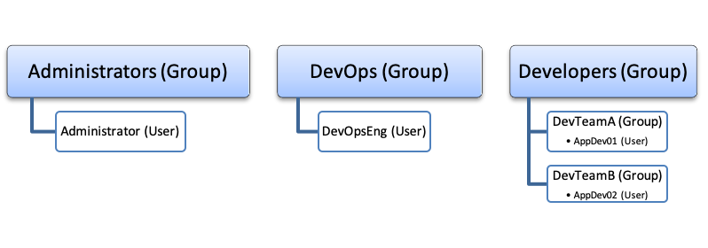

# Tanzu Kubernetes Operations(TKO) PoC Test Plan & Evaluation Overview

This PoC test plan and evaluation process focuses on demonstrating functional operation, capabilities, and features of the Tanzu Kubernetes Operations(TKO) product suite. This POC is to spike on-prem data center Kubernetes solution that VMWare Tanzu provides and evaluate creation and management of production grade Kubernetes clusters with operational simplicity, cost efficiency, and automation support.

**IMPORTANT** - This pre-sales offering does not consider all best practices and recommendations for production or extended pilot use.  VMware strongly encourages Customers to thoroughly review all publicly available product documentation and engage with the Professional Services Organization and Partners before going forward with any production design decisions. The PoC evaluation system is not the appropriate platform for intensive and lengthy performance testing and evaluation.

## Intended Audience

This guide is for cloud architects, engineers, administrators, and developers whose organization has an interest integrating Tanzu Kubernetes Operations(TKO) components and platform into their multi-cloud strategy and environments.

## Scope

The Tanzu for Kubernetes Operations(TKO) PoC test and evaluation process focuses on demonstrating functional operation, capabilities, and features of the Tanzu for Kubernetes Operations(TKO) platform and Tanzu Kubernetes Clusters (TKC) deployed at on-prem data centers.


## Goals and Objectives

The goal is promoting Customer confidence in the Tanzu for Kubernetes Operations(TKO) products through an inclusive test approach and procedures worthy for judging the platform’s operational effectiveness and suitability. The following table lists the Tanzu for Kubernetes Operations(TKO) PoC test process' objectives:

ID | Objective |
:-- | :-- |
OB01|Prove the automation and simplicity of deploying and operationalizing Kubernetes clusters
OB02|Reveal the advanced, on-demand networking and security capabilities that vSphere 7 with Kubernetes and NSX-T enable through the Kubernetes Container Network Interface (CNI) plug-in
OB03|Validate the support for applications to leverage multitude of storage options through the vSphere Cloud Native Storage (CNS) – Container Storage Interface (CSI)
OB04|Show the level of monitoring, alerting, and visibility available through integrations with Tanzu Observability and other Open Source Software (OSS) alternatives
OB05|Exhibit the availability of centralized multi-cluster Kubernetes management(TMC),multi-master clusters, and the self-healing resiliency of the individual cluster nodes
OB06|Demonstrate the ability for operators to easily and quickly scale-out Kubernetes clusters resources on-demand
OB07|Without disruption to running containerized applications, demonstrate patching and upgrading Kubernetes clusters
OB08|Show the coexistence of both traditional VM-based and containerized applications running parallel on common infrastructure resources
OB09|Demonstrate vSphere 7 with Kubernetes multi-tenancy and Role Based Access Control (RBAC) capabilities for enterprise environments
OB10|Demonstrate managing and securely serving images for containerized applications
OB11|Demonstrate lifecycle management functions(create, modify, delete) for Service mesh using Tanzu Service Mesh


## System Users and Roles

>NOTE: BEFORE PROCEEDING TO THE TEST CASES, READ THIS SECTION IN ITS ENTIRETY AS IT INCLUDES PREPARATIONS AND PREREQUISITES REQUIRED TO SUCCESSFULLY RUN THE TEST CASES.

The test approach bases the test scenarios and executing the test procedures from the perspective of standard operations and developments roles. System user accounts or groups of users map to symbolizing roles defined within the vSphere 7 with Tanzu platform and Kubernetes clusters. Following user authentication, a user’s role association determines his/her level of authorization and entitlements while interacting with the interfaces and system resources.

vSphere 7 with Tanzu integrates with vCenter Single Sign-On (SSO), which is an authentication broker and security token exchange infrastructure, for authenticating system users and authorizing access to system resources. vCenter SSO supports multiple identity sources including local domain, Active Directory, and LDAP. Securing access control for vSphere 7 with Kubernetes requires applying privilege policies at multiple layers in the stack. Executing this test plan requires establishing user accounts and groups in the vCenter SSO local domain and/or linked identity source(s). The following image provides a conceptual representation of how the test plan organizes users and groups membership.

Additional information on configuring [Identify Sources for vCenter Server with vCenter Single Sign-On is available on VMware Docs](<https://docs.vmware.com/en/VMware-vSphere/7.0/com.vmware.vsphere.authentication.doc/GUID-1F0106C9-0524-4583-9AC5-A748FD1DC4C5.html>).



### vSphere Administrator

As a vSphere administrator, the primary interface for interacting with the vSphere with Kubernetes platform is the vSphere Client. At a high level, vSphere Administrators’ responsibilities involve configuring a Supervisor Cluster and namespaces, where DevOps engineers can deploy Kubernetes workloads. vSphere Administrators should have excellent knowledge about the vSphere and NSX-T technologies, and basic understanding about Kubernetes.

Test cases involving the vSphere administrator role require at least one (1) user account that is either a member of the vCenter SSO, Administrators group or mapped to a vCenter role with the following privileges and permissions for the participating vSphere cluster(s).

* **Namespaces.Modify cluster-wide configuration** or **Namespaces.Modify namespace configuration**
* **Profile-driven storage. Profile-driven storage view** and **update**
* **vSphere Tagging.Create vSphere Tag** on the root vCenter Server instance
* **vSphere Tagging.Create vSphere Tag** Category on the root vCenter Server instance
* **vSphere Tagging.Assign** and **Unassign vSphere Tag** on the root vCenter Server instance
* **Content Library.Create subscribed library** or **Content Library.Create local library**
* **Datastore.Allocate space** on the destination datastore

For additional details, reference [Authentication for vSphere with Kubernetes](https://docs.vmware.com/en/VMware-vSphere/7.0/vmware-vsphere-with-kubernetes/GUID-93B29112-4492-431F-958A-12323540C38D.html)

### DevOps Engineer

A DevOps engineer might be a Kubernetes developer and an application owner, a Kubernetes administrator, or combine functions of both. A DevOps engineer uses kubectl commands to deploy vSphere Pods and Tanzu Kubernetes clusters within existing namespaces on the Supervisor Cluster. Typically, a DevOps engineer does not need to be an expert on vSphere and NSX-T but has basic understanding about these technologies and the vSphere 7 with Kubernetes platform to interact with the vSphere administrators more efficiently.

Test cases involving the DevOps engineer role require at least one (1) user account. The recommendation is to create a group such as one named DevOps in the identity source and add individual user accounts as members to the group.  After enabling a vSphere cluster as a Supervisor cluster and creating a namespace, the vSphere administrator will have the ability to entitle the DevOps engineer with namespace-level permissions.  There are two types of permissions, edit and view. This test plan requires the DevOps engineer to maintain edit permissions across namespaces. With the namespace edit permission entitlement, the DevOps engineer will automatically receive cluster-admin privileges for all TKG cluster deployed within the namespace, respectively.

### Application Developer

Application developers translate business and product objectives into application code. They administer the application development life cycle through CI/CD pipeline automation and an assortment of product integrations. They connect to a Tanzu Kubernetes cluster and use kubectl commands or other tools such as Helm or Jenkins to deploy workloads, including pods, services, load balancers, and other resources.

Test cases involving the application developer role require at least two (2) user accounts. The recommendation is to create two (2) groups such as DevTeamA and DevTeamB in the identity source and add individual user accounts as members to the groups.  After the DevOps engineer deploys a TKG cluster, the DevOps engineer will have the ability to entitle the application developer with permissions to the TKG cluster through standard Kubernetes RBAC policies.


## Tanzu for Kubernetes Operations(TKO) PoC Process Flow

The quality and completeness of the Customer test goals and objectives, or success criteria, are the key input to constructing useful test cases and producing meaningful results. With that input, the Customer Technical Leads and VMware Systems Engineers can derive a base set of requirements. Then, after analyzing the requirements, generate test scenarios that represent the operational use of the system.  Next, develop test cases within each scenario, ensuring complete allocation of requirements and quantifiable expectations. Finally, execute the test cases to validate system operation and verify compliance with the requirements. 

### Summary Requirements Analysis

The following table contains an assemblage of requirements inferred by the technology; revised and repurposed from Customer's High level requirements; derived from frequently mentioned Customers' goals and objectives; community involvement; and learned through research and development. The requirements form the basis of the test cases inventory and the test procedures, detailed in later sections. Each requirement maps to its overarching objective and test case(s) responsible for demonstrating functional compliance. Because the test approach is scenario-driven, there is not a 1:1 relationship for all requirements and some requirements may be indirectly satisfied by an encompassing test case.


High-level Requirement | ID	| Requirement Description |	Test Case ID(s)	| Status |
--- | --- | --- | --- | --- |
Operate and Manage Kubernetes Infrastructure | RQ01 - 01	| CaaS platform shall provide tools to support multiple tenants/clients<br>CaaS platform shall provide automation/tools/API for governing the configuration of the clusters<br>CaaS platform shall provide role based access control by integrating with identity system(Active directory)<br>CaaS platform shall create and configure a Supervisor Cluster Namespace(s) with Resource Limitations | |
New user cluster creation |	RQ01 - 02 |	CaaS platform shall provide automation/tools/API for creation,modification, and deletion of kubernetes clusters		
Namespaces creation and setup - Namespace naming, Resource limitation, network policies | RQ01 - 03 |	CaaS platform shall create and configure a workload Cluster Namespace(s),  Resource Limitations<br>CaaS platform shall provide automation/tools/API to apply Network Policy Enforcement for a Sample App Deployed to a Tanzu Kubernetes Cluster | |		
Limited permission to namespaces access grant - ADFS integretion, 24 hours assess token creation/delivery |	RQ01 - 04 |	CaaS platform shall provide automation/tools/API to apply RBAC to a Tanzu Kubernetes Grid Cluster and Granting Developer Access | |
Istio/Service Mesh installation |	RQ01 - 05 |	CaaS platform shall provide lifecycle management functions(create, modify, delete) for Service mesh | |
DNS and Cert - Use existing doamin and certs, wildcard already there |	RQ01 - 06 |	CaaS platform shall provide delegated DNS for applications hosted in kubernetes clusters<br>CaaS platform shall facilitate the automatic provisioning of Layer-7 HTTP load-balancers for Kubernetes ingress resources.<br>CaaS platform shall allow the importation of custom CA-signed certificates for use with Kubernetes ingress resources | |
Image Registry, Image scaning |	RQ01 - 07 |	TBD<br>CaaS platform shall provide automation/tools/API to apply content trust policies on TKG clusters to access images from a private container registry | |
jFrog artifactory integration |	RQ01 - 08 |	CaaS platform shall provide cluster access to the images residing in the private jFrog Container Registry | |
Monitoring/Tracing |	RQ01 - 09 |	CaaS platform shall provide tools for monitoring the infrastructure(virtual machines, pods, containers, ingress) of the kubernetes clusters | |
Dynatrace client deployment |	RQ01 - 10 |	CaaS platform shall support Dynatrace client deployment | |
Provide access and collaborate with engineering team to deploy test applications, Scai and test at the application level |	RQ01 - 11 |	CaaSplatformshall aprovide utomation/tools/API to access and collaborate with engineering team to deploy test applications(Scai) | |
Secured access from application workload to existing VM based Oracle database deployment |	RQ01 - 12 |	CaaS platform shall support secured access from application workload to existing VM based Oracle database deployment. | |
deploy over 2 hosts, turn off one host  |	RQ01 - 13 |	CaaS platform shall support Self-Healing Tanzu Kubernetes Cluster | |
logs to splunk, esp security related logs.  |	RQ01 - 14 |	CaaS platform shall support integration to log aggregators(Splunk) | |
Node OS upgrade |	RQ01 - 15 |	TBD | |
Kuberentes version upgrade |	RQ01 - 16 |	CaaS platform shall provide automation/tools/API for cluster upgrade | |
Software patching/upgrade |	RQ01 - 17 |	TBD | |
Vernerbility scanning and alerting |	RQ01 - 18 |	TBD | |
Cert creation and rotation, if needed  |	RQ01 - 19 |	CaaS platform shall provide automation/tools/API to manage platform Certs | |
Resource monitoring and alerting |	RQ01 - 20 |	CaaS platform shall provide tools for monitoring the infrastructure(virtual machines, pods, containers, ingress) of the kubernetes clusters<br>CaaS platform shall alert based on thresholds<br>CaaS platform shall provide monitoring dashboards for operators | |
Backup and Restore - cluster level and app level |	RQ01 - 21 |	CaaS platform shall provide automation/tools/API to Backup and Restore a Tanzu Kubernetes Cluster(s), and Apps | |
Networking needs for communication between base, adming, and user clusters |	RQ01 - 22 |				
External LB provision and attachment - Supposed to be provided NSX |	RQ01 - 23 |	CaaS platform shall provide tools for provisioning load balancers/ingress for the kubernetes clusters | |
Storage attachment  |	RQ01 - 24 |	CaaS platform shall automate the Kubernetes storage provider integration so Kubernetes pods can mount static and dynamic persistent volumes from existing datastores<br>CaaS platform shall provide persistent storage capabilities for containerized applications | |
Firewall/Route to Oracle database stack - ACLs to single IP |	RQ01 - 25 |	CaaS platform shall support on-demand configuration of network security policies, which allow for micro-segmenting flows between two (2) or more pods sharing a common network or between namespaces and external IP networks | |
Cluster access kubeconfig management and integration with SPM AD |	RQ01 - 26 |	CaaS platform shall provide role based access control on worker clusters by integrating with SPM Active directory | |
Certificates provision and management for cluster communication user |	RQ01 - 27 |	CaaS platform shall allow the importation of custom CA-signed certificates for use with Kubernetes ingress resources | |
Certificates provision and management for applications  |	RQ01 - 28 |	TBD<br>CaaS platform shall allow the importation of custom CA-signed certificates for use with Kubernetes ingress resources | |
Secret management, integration with on-prem Vault service |	RQ01 - 29 |	CaaS platform shall provide automation/tools/api to integration with on-prem Vault service for secrets management on worker clusters | |
Virus scan service, WAF, IDS/IPS TBD |	RQ01 - 30 |	TBD | |
Built-in automation of the above process |	RQ01 - 31 |	TBD | |
Api support  |	RQ01 - 32 |	TBD | |
24*7 support |	RQ01 - 33 |	TBD | |
professional services |	RQ01 - 34 |	TBD | |
Turn-around time |	RQ01 - 35 |	TBD | |
Toolset usability |	RQ01 - 36 |	TBD | |
Performance |	RQ01 - 37 |	TBD | |


## Test Environment

>NOTE: BEFORE PROCEEDING TO THE TEST CASES, READ THIS SECTION IN ITS ENTIRETY AS IT INCLUDES PREPARATIONS AND PREREQUISITES REQUIRED TO SUCCESSFULLY RUN THE TEST CASES.

The test cases within this document assume that the installation of vSphere 7 with Tanzu, NSX-T, Cloud Services like Tanzu Mission Control (TMC), Tanzu Service Mesh (TSM), and Tanzu Observability (TO) are complete and deployed to an infrastructure prepared according to the requirements detailed in the "VMware vSphere 7 with Tanzu PoC Prerequisites and Preparations Guide." Additionally, it assumes that the Customer engaged with a VMware Systems Engineer for the vSphere 7 with Tanzu PoC design and installation.  The following subsections identify the environment expectations, software and tools required for effectively conducting the test and evaluation process.

### Software Test Tools

This project contains a `Dockerfile` that comes with preconfigured CLIs like `kubectl`, `tanzu`, `kubectl-vshpere`, ... to provide a pre-built and configured environment that makes executing the provided test cases easier (Called here as Local Management Container).To be able to connect with a Kubernetes Cluster copy/download that Kubernetes Cluster's `kubeconfig` to a file located in `config/kube.conf` inside this project structure (This file should not be checked into a public source repository). When running the Local Management Container from the supplied `make` file the `kubeconfig` will be automatically mapped/copied to the running continer and allow for `kubectl` commands to your Kubernetes Cluster.

#### Building and Running the Local Management Container

##### Build Container

```sh
make build
```

##### Rebuild Container

```sh
make rebuild
```

##### Start and exec to the container

```sh
make run
```

##### Join Running Container

```sh
make join
```

##### Start an already built Local Management Container

```sh
make start
```

##### Stop a running Local Management Container*

```sh
make stop
```

### Test-Cases-Inventory

#### Operator SC01: Operate and Manage Kubernetes Infrastructure

Test Case ID | Test Case Description |
--- | --- |


#### DevOps SC02: Provision and Manage Kubernetes Workload Clusters

Test Case ID | Test Case Description |
--- | --- |

